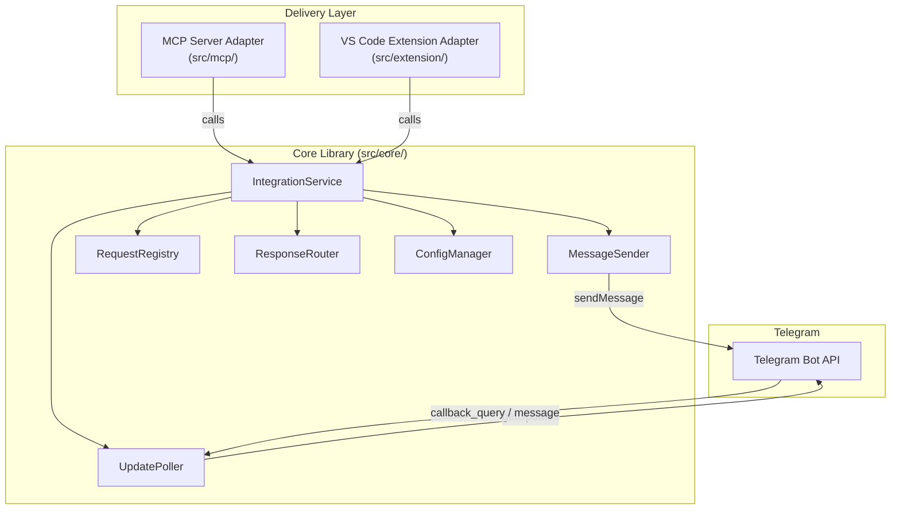
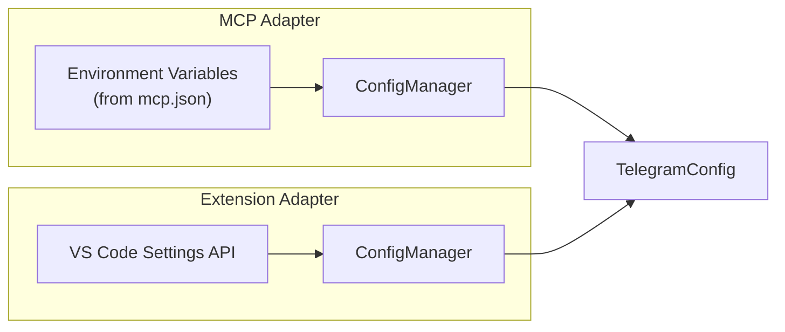

# Design Document: Kiro Telegram Integration

## Overview

This design describes a dual-delivery architecture for integrating Kiro IDE with the Telegram Bot API. The system enables developers to approve/cancel actions and provide textual input remotely via Telegram.

The architecture separates concerns into three layers:

1. **Core Library** (`src/core/`) — Delivery-agnostic Telegram logic (~90% of code): ConfigManager, MessageSender, RequestRegistry, UpdatePoller, ResponseRouter, and IntegrationService.
2. **MCP Server Adapter** (`src/mcp/`) — Thin wrapper exposing the core as an MCP server. This is the **primary** delivery mechanism.
3. **VS Code Extension Adapter** (`src/extension/`) — Thin wrapper exposing the core as a VS Code extension. This is the **secondary** delivery mechanism.

Both adapters call the same `IntegrationService` interface from core. The core library has zero knowledge of how it is hosted.

### Key Design Decisions

- **Dual-Delivery Architecture**: The core logic is delivery-agnostic, allowing the same Telegram integration to be consumed as an MCP server (for Kiro and other MCP-compatible tools) or as a VS Code extension. This maximizes reuse and distribution flexibility.
- **MCP-First**: The MCP server adapter is built first because it is simpler (no UI framework dependency), aligns with Kiro's MCP-based tool ecosystem, and can be distributed via npm/npx with zero installation friction.
- **TypeScript**: Chosen for type safety, IDE tooling support, and alignment with both the Kiro/MCP ecosystem and VS Code extension API.
- **Long Polling over Webhooks**: Default update retrieval method. Long polling requires no public-facing server, simplifying setup for individual developers.
- **No Telegram SDK dependency**: Direct HTTP calls to the Telegram Bot API via Node.js `fetch` (available in Node 18+). Keeps the integration lightweight.
- **In-memory request registry**: Pending requests are stored in a `Map` keyed by unique ID. No persistence layer is needed since requests are short-lived (default 10-minute timeout).

### Prerequisites

- Node.js v18+ (required for native `fetch` and MCP server runtime)
- Telegram bot created via [BotFather](https://t.me/BotFather)
- Bot token and chat ID obtained from Telegram

## Architecture

### Project Structure

```
kiro-telegram-integration/
├── src/
│   ├── core/                # Delivery-agnostic core library
│   │   ├── ConfigManager.ts
│   │   ├── MessageSender.ts
│   │   ├── RequestRegistry.ts
│   │   ├── UpdatePoller.ts
│   │   ├── ResponseRouter.ts
│   │   ├── IntegrationService.ts
│   │   └── types.ts
│   ├── mcp/                 # MCP server adapter (primary)
│   │   ├── server.ts        # MCP server entry point
│   │   └── tools.ts         # MCP tool definitions
│   └── extension/           # VS Code extension adapter (secondary)
│       ├── extension.ts     # Extension entry point
│       ├── commands.ts      # VS Code command registrations
│       └── statusBar.ts     # Status bar integration
├── package.json
├── tsconfig.json
└── LICENSE
```

### System Architecture Diagram



### Data Flow

1. An adapter (MCP server or VS Code extension) receives a request from its host environment.
2. The adapter calls `IntegrationService.requestConfirmation()` or `requestInformation()` on the core library.
3. The `MessageSender` formats and sends the message to Telegram with inline keyboard or ForceReply markup.
4. The `RequestRegistry` stores the pending request with a unique ID and starts a timeout timer.
5. The `UpdatePoller` continuously polls Telegram for new updates (callback queries and messages).
6. The `ResponseRouter` matches incoming updates to pending requests using the unique ID embedded in callback data or reply-to-message references.
7. The matched response is returned to the adapter, which forwards it to the host environment.
8. If the timeout elapses, the request is resolved as timed out and the Telegram message is edited.

### Configuration Flow



- **MCP Adapter**: Reads `TELEGRAM_BOT_TOKEN` and `TELEGRAM_CHAT_ID` from environment variables, which are passed via the `mcp.json` configuration file. Global config lives at `~/.kiro/settings/mcp.json`.
- **Extension Adapter**: Reads configuration from VS Code's settings API (`vscode.workspace.getConfiguration`).

## Components and Interfaces

### Core Library (`src/core/`)

#### ConfigManager

Manages loading, validating, and providing access to bot configuration. The ConfigManager accepts config from any source — it does not know where the values come from.

```typescript
interface TelegramConfig {
  botToken: string;
  chatId: string;
  timeoutMs: number;       // default: 600_000 (10 minutes)
  maxRetries: number;       // default: 3
  maxBackoffMs: number;     // default: 60_000
}

interface ConfigManager {
  /** Create a TelegramConfig from raw key-value pairs. */
  fromRecord(record: Record<string, string | undefined>): TelegramConfig;

  /** Validate that botToken and chatId are present and non-empty. */
  validateConfig(config: TelegramConfig): ValidationResult;

  /** Verify connectivity by calling Telegram's getMe endpoint. */
  verifyConnectivity(config: TelegramConfig): Promise<ConnectivityResult>;
}

interface ValidationResult {
  valid: boolean;
  errors: string[];
}

interface ConnectivityResult {
  connected: boolean;
  botUsername?: string;
  error?: string;
}
```

#### MessageSender

Handles formatting and sending messages to Telegram with retry logic.

```typescript
interface MessageSender {
  /** Send a confirmation request with Approve/Cancel inline keyboard. */
  sendConfirmationRequest(
    context: ActionContext,
    requestId: string
  ): Promise<SentMessage>;

  /** Send an information request with ForceReply markup. */
  sendInformationRequest(
    prompt: string,
    context: string,
    requestId: string
  ): Promise<SentMessage>;

  /** Edit an existing message (used for timeout/expiry updates). */
  editMessage(messageId: number, text: string): Promise<void>;

  /** Send a plain notification message. */
  sendNotification(text: string): Promise<SentMessage>;
}

interface ActionContext {
  actionType: string;
  affectedFiles: string[];
  summary: string;
}

interface SentMessage {
  messageId: number;
  chatId: string;
  timestamp: number;
}
```

#### RequestRegistry

Manages the lifecycle of pending requests.

```typescript
type RequestType = 'confirmation' | 'information';
type RequestStatus = 'pending' | 'approved' | 'cancelled' | 'answered' | 'timed_out';

interface PendingRequest {
  id: string;
  type: RequestType;
  status: RequestStatus;
  messageId: number;
  createdAt: number;
  timeoutMs: number;
  timeoutHandle: ReturnType<typeof setTimeout>;
  resolve: (result: RequestResult) => void;
}

interface RequestResult {
  requestId: string;
  status: RequestStatus;
  data?: string;  // reply text for information requests
}

interface RequestRegistry {
  /** Add a new pending request and start its timeout timer. */
  add(request: PendingRequest): void;

  /** Look up a pending request by its unique ID. */
  get(requestId: string): PendingRequest | undefined;

  /** Resolve a request with a result and remove it from the registry. */
  resolve(requestId: string, result: RequestResult): void;

  /** Remove a request from the registry (cleanup). */
  remove(requestId: string): void;

  /** Get count of currently pending requests. */
  pendingCount(): number;

  /** Check if a request ID exists and is still pending. */
  isPending(requestId: string): boolean;
}
```

#### UpdatePoller

Handles long-polling the Telegram Bot API for updates.

```typescript
interface UpdatePoller {
  /** Start polling for updates. */
  start(): void;

  /** Stop polling. */
  stop(): void;

  /** Register a handler for incoming updates. */
  onUpdate(handler: (update: TelegramUpdate) => void): void;
}

interface TelegramUpdate {
  update_id: number;
  callback_query?: CallbackQuery;
  message?: TelegramMessage;
}

interface CallbackQuery {
  id: string;
  data: string;
  message: TelegramMessage;
}

interface TelegramMessage {
  message_id: number;
  chat: { id: number };
  text?: string;
  reply_to_message?: TelegramMessage;
}
```

#### ResponseRouter

Matches incoming Telegram updates to pending requests.

```typescript
interface ResponseRouter {
  /** Process an incoming update and route it to the correct pending request. */
  routeUpdate(update: TelegramUpdate): Promise<RoutingResult>;
}

interface RoutingResult {
  matched: boolean;
  requestId?: string;
  error?: string;
}
```

#### IntegrationService (Core Public API)

The main entry point for adapters. Both the MCP server and VS Code extension call this interface.

```typescript
interface IntegrationService {
  /** Initialize the service with a pre-built TelegramConfig. */
  initialize(config: TelegramConfig): Promise<void>;

  /** Request user confirmation for an action. Returns a promise that resolves with the user's decision. */
  requestConfirmation(context: ActionContext): Promise<RequestResult>;

  /** Request additional information from the user. Returns a promise that resolves with the user's reply. */
  requestInformation(prompt: string, context: string): Promise<RequestResult>;

  /** Shut down the service, cleaning up timers and polling. */
  shutdown(): Promise<void>;
}
```

### MCP Server Adapter (`src/mcp/`)

A thin wrapper that exposes the core `IntegrationService` as an MCP server. This is the primary delivery mechanism.

#### How It Works

1. Kiro (or any MCP-compatible client) starts the MCP server process via the `mcp.json` configuration.
2. The server reads `TELEGRAM_BOT_TOKEN` and `TELEGRAM_CHAT_ID` from environment variables.
3. It creates a `TelegramConfig` via `ConfigManager.fromRecord(process.env)`, initializes the `IntegrationService`, and registers MCP tools.
4. The MCP client invokes tools like `telegram_confirm` or `telegram_ask`, which delegate to `IntegrationService`.

#### MCP Configuration (`mcp.json`)

```json
{
  "mcpServers": {
    "telegram-integration": {
      "command": "npx",
      "args": ["kiro-telegram-integration"],
      "env": {
        "TELEGRAM_BOT_TOKEN": "<token>",
        "TELEGRAM_CHAT_ID": "<chat-id>"
      }
    }
  }
}
```

#### MCP Tool Definitions

```typescript
// Tool: telegram_confirm
// Sends a confirmation request to Telegram and waits for user response.
interface TelegramConfirmInput {
  actionType: string;
  summary: string;
  affectedFiles: string[];
}
// Returns: { status: "approved" | "cancelled" | "timed_out", requestId: string }

// Tool: telegram_ask
// Sends an information request to Telegram and waits for user reply.
interface TelegramAskInput {
  prompt: string;
  context: string;
}
// Returns: { status: "answered" | "timed_out", data?: string, requestId: string }

// Tool: telegram_notify
// Sends a one-way notification to Telegram (no response expected).
interface TelegramNotifyInput {
  message: string;
}
// Returns: { messageId: number }

// Tool: telegram_status
// Returns the current status of the integration (connected, pending request count, etc.).
// Returns: { connected: boolean, botUsername?: string, pendingRequests: number }
```

#### Distribution

- Published to npm as `kiro-telegram-integration`
- Runnable via `npx kiro-telegram-integration` (the `bin` field in `package.json` points to the MCP server entry point)
- The MCP server communicates over stdio (standard MCP transport)

### VS Code Extension Adapter (`src/extension/`)

A thin wrapper that exposes the core `IntegrationService` as a VS Code extension. This is the secondary delivery mechanism, built after the MCP adapter.

#### How It Works

1. The extension activates on VS Code startup (or on first command invocation).
2. It reads `TELEGRAM_BOT_TOKEN` and `TELEGRAM_CHAT_ID` from VS Code settings.
3. It creates a `TelegramConfig` via `ConfigManager.fromRecord(settings)`, initializes the `IntegrationService`.
4. It registers VS Code commands, a settings panel, and a status bar item.

#### VS Code Extension Interface

```typescript
// VS Code Settings (contributes.configuration)
interface ExtensionSettings {
  "kiroTelegram.botToken": string;
  "kiroTelegram.chatId": string;
  "kiroTelegram.timeoutMinutes": number;  // default: 10
}

// VS Code Commands (contributes.commands)
// - kiroTelegram.configure    — Open settings panel
// - kiroTelegram.testConnection — Verify bot connectivity
// - kiroTelegram.status       — Show connection status in notification

// Status Bar Item
// Shows connection status icon (✓ connected, ✗ disconnected)
// Shows pending request count when > 0
// Clicking opens the command palette with kiroTelegram commands
```

#### Distribution

- Packaged as a `.vsix` file via `vsce package`
- Publishable to Open VSX Registry
- Can also be installed from a local `.vsix` file

## Data Models

### Configuration Sources

| Adapter | Config Source | Location |
|---|---|---|
| MCP Server | Environment variables | Passed via `mcp.json` `env` block |
| MCP Server | Global config | `~/.kiro/settings/mcp.json` |
| VS Code Extension | VS Code Settings API | `settings.json` → `kiroTelegram.*` |

The core `ConfigManager.fromRecord()` accepts a flat `Record<string, string | undefined>` so it is agnostic to the source. Each adapter is responsible for reading its own config source and passing it as a record.

### TelegramConfig

```typescript
interface TelegramConfig {
  botToken: string;
  chatId: string;
  timeoutMs: number;       // default: 600_000 (10 minutes)
  maxRetries: number;       // default: 3
  maxBackoffMs: number;     // default: 60_000
}
```

### Callback Data Encoding

Inline keyboard button callback data encodes the request ID and action:

```
Format: {requestId}:{action}
Example: "a1b2c3d4:approve" or "a1b2c3d4:cancel"
```

This is parsed by the `ResponseRouter` to match callback queries to pending requests.

### Information Request Reply Matching

For information requests, the `ForceReply` markup causes the user's Telegram client to create a reply-to-message reference. The `ResponseRouter` matches the `reply_to_message.message_id` to the stored `messageId` in the `RequestRegistry` to identify which pending request the reply belongs to.

### Message Templates

Confirmation request message (MarkdownV2):
```
🔔 *Action Required*

*Type:* {actionType}
*Summary:* {summary}
*Files:*
{affectedFiles joined by newlines}

_Reply within {timeout} minutes or this request will expire\._
```

Information request message (MarkdownV2):
```
❓ *Information Needed*

{prompt}

_Context:_ {context}

_Reply to this message with your answer\. This request expires in {timeout} minutes\._
```

### Truncation

Messages exceeding 4096 characters are truncated at 4050 characters with the suffix:

```
\n\n⚠️ _Message truncated\. Full details available in Kiro IDE\._
```

## Correctness Properties

*A property is a characteristic or behavior that should hold true across all valid executions of a system — essentially, a formal statement about what the system should do. Properties serve as the bridge between human-readable specifications and machine-verifiable correctness guarantees.*

All properties below apply to the core library. The adapter layers are thin pass-throughs and do not introduce new correctness concerns beyond configuration sourcing.

### Property 1: Config validation rejects incomplete configurations

*For any* configuration object where `botToken` or `chatId` is missing, empty, or whitespace-only, `validateConfig` should return `{ valid: false }` with a non-empty `errors` array containing instructions for the missing fields.

**Validates: Requirements 1.1, 1.2**

### Property 2: Bot token is never exposed in serialized output

*For any* configuration object with a non-empty `botToken`, serializing the config for logging or display should produce a string that does not contain the original `botToken` value.

**Validates: Requirements 1.5**

### Property 3: All requests receive unique identifiers

*For any* sequence of N requests (confirmation or information), the set of assigned request IDs should have exactly N distinct elements.

**Validates: Requirements 2.6, 3.5**

### Property 4: Confirmation messages contain complete ActionContext and correct markup

*For any* `ActionContext` with non-empty `actionType`, `summary`, and `affectedFiles`, the formatted confirmation message should contain all three fields, use MarkdownV2 or HTML parse mode, and include an inline keyboard with buttons labeled "Approve" and "Cancel".

**Validates: Requirements 2.2, 2.3, 6.1, 6.2**

### Property 5: Information messages contain prompt, context, and ForceReply markup

*For any* non-empty prompt string and context string, the formatted information request message should contain both the prompt and context text, and the message payload should include `force_reply: true`.

**Validates: Requirements 3.2, 3.4, 6.3**

### Property 6: All outgoing messages target the configured Chat_ID

*For any* request (confirmation or information), the outgoing Telegram API call should use the `chatId` from the loaded configuration.

**Validates: Requirements 2.1, 3.1**

### Property 7: Callback query routing resolves the correct pending request with the correct status

*For any* pending confirmation request and a callback query whose data contains that request's ID and an action ("approve" or "cancel"), the `ResponseRouter` should match the callback to that request and resolve it with the corresponding status ("approved" or "cancelled").

**Validates: Requirements 2.4, 2.5, 5.2**

### Property 8: Text reply routing resolves the correct pending information request with the reply text

*For any* pending information request and a text message whose `reply_to_message.message_id` matches the request's `messageId`, the `ResponseRouter` should match the reply to that request and resolve it with status "answered" and the reply text as data.

**Validates: Requirements 3.3, 5.3**

### Property 9: Unmatched responses trigger a notification

*For any* incoming update (callback query or text reply) that does not match any pending request in the registry, the `ResponseRouter` should send a notification message informing the user that no matching pending request was found.

**Validates: Requirements 5.4**

### Property 10: Message truncation respects the 4096-character limit

*For any* message content string, the formatted output should never exceed 4096 characters. If the input exceeds the limit, the output should end with a truncation indicator and the total length should be at most 4096 characters.

**Validates: Requirements 6.4**

### Property 11: Registry add/resolve round trip

*For any* set of pending requests added to the `RequestRegistry`, each request should be retrievable by its ID while pending. After resolving a request, it should no longer be retrievable, and the pending count should decrease by one.

**Validates: Requirements 7.2, 7.3**

### Property 12: Timeout resolves requests as timed out

*For any* pending request, when the configured timeout elapses without a response, the request should resolve with status "timed_out".

**Validates: Requirements 4.1, 4.2**

### Property 13: Responses to expired requests trigger an expiry notification

*For any* response received for a request that has already been resolved (timed out or otherwise), the service should send a Telegram message informing the user that the request has expired.

**Validates: Requirements 4.4**

### Property 14: Retry count respects configuration

*For any* message send operation that fails, the sender should retry up to `maxRetries` times before giving up. The total number of attempts should be at most `maxRetries + 1` (initial attempt plus retries).

**Validates: Requirements 8.1**

### Property 15: Exponential backoff intervals are bounded

*For any* sequence of retry or reconnection attempts, the backoff interval should increase exponentially but never exceed `maxBackoffMs`.

**Validates: Requirements 8.3**

### Property 16: Polling resumes from last known offset

*For any* sequence of processed updates, the next poll request should use an offset equal to the highest `update_id` seen plus one.

**Validates: Requirements 8.4**

### Property 17: Callback data round trip

*For any* request ID and action string, encoding the callback data as `{requestId}:{action}` and then parsing it should yield the original request ID and action.

**Validates: Requirements 5.2**

## Error Handling

### Configuration Errors

| Error Condition | Behavior |
|---|---|
| Missing or empty `botToken` | Return validation error with setup instructions. Do not attempt any API calls. |
| Missing or empty `chatId` | Return validation error with setup instructions. Do not attempt any API calls. |
| `getMe` call fails (invalid token) | Return connectivity error indicating the token is invalid. |
| `getMe` call fails (network) | Return connectivity error indicating the API is unreachable. |
| MCP: Missing env vars | MCP server logs error and exits with non-zero code. Kiro shows MCP server failure. |
| Extension: Missing settings | Extension shows notification with link to settings panel. |

### Message Sending Errors

| Error Condition | Behavior |
|---|---|
| Telegram API returns HTTP 4xx | Do not retry (client error). Return error to caller. |
| Telegram API returns HTTP 5xx | Retry up to `maxRetries` times with exponential backoff. |
| Network timeout / connection refused | Retry up to `maxRetries` times with exponential backoff. |
| All retries exhausted | MCP: Return error result to MCP client. Extension: Display error notification in VS Code. |

### Polling Errors

| Error Condition | Behavior |
|---|---|
| Poll request fails | Reconnect with exponential backoff (max 60s interval). |
| Invalid update format | Log warning, skip the update, advance offset. |
| Connectivity restored | Resume from last known offset. |

### Request Lifecycle Errors

| Error Condition | Behavior |
|---|---|
| Timeout elapses | Resolve request as `timed_out`. Edit Telegram message to show expiry. |
| Response for expired request | Send notification to user that the request has expired. |
| Response with unknown request ID | Send notification to user that no matching request was found. |
| Duplicate response for same request | Ignore (request already removed from registry). |

### Adapter-Specific Errors

| Error Condition | Adapter | Behavior |
|---|---|---|
| MCP server process crashes | MCP | Kiro automatically restarts the MCP server per mcp.json config. Core state is lost (in-memory registry). |
| VS Code extension deactivated | Extension | `IntegrationService.shutdown()` is called. Pending requests are resolved as timed out. |
| MCP tool called before initialization | MCP | Return MCP error response indicating the service is not yet initialized. |

## Testing Strategy

### Testing Framework

- **Unit Testing**: Vitest (fast, TypeScript-native, compatible with Node.js)
- **Property-Based Testing**: fast-check (mature PBT library for TypeScript/JavaScript)
- **Mocking**: Vitest built-in mocking for Telegram API calls

### Test Scope

All property-based tests and the majority of unit tests target the core library (`src/core/`). The adapter layers are thin enough to be covered by integration tests and a small number of unit tests verifying config sourcing.

### Unit Tests

Unit tests cover specific examples, edge cases, and integration points:

**Core Library:**
- **ConfigManager**: Valid config from record, missing fields, empty strings, whitespace-only values, connectivity success/failure responses, `fromRecord` with various env var shapes
- **MessageSender**: Correct API payload structure for confirmation and information requests, truncation at boundary (exactly 4096 chars, 4097 chars)
- **RequestRegistry**: Add/get/resolve lifecycle, resolve non-existent ID, concurrent add/resolve
- **UpdatePoller**: Offset tracking after processing updates, stop/start lifecycle
- **ResponseRouter**: Callback query matching, text reply matching, unmatched response handling, expired request response
- **IntegrationService**: End-to-end flow with mocked Telegram API (send confirmation → receive approve callback → resolve)

**MCP Adapter:**
- Tool registration (all 4 tools registered with correct schemas)
- Config loading from `process.env`
- Error response when env vars are missing

**Extension Adapter:**
- Config loading from VS Code settings API
- Command registration
- Status bar updates on connection state changes

### Property-Based Tests

Each property test runs a minimum of 100 iterations using fast-check. Each test references its design property.

| Property | Test Description | Generator Strategy |
|---|---|---|
| Property 1 | Generate random config objects with missing/empty fields | `fc.record` with optional/empty string fields |
| Property 2 | Generate random bot tokens, serialize config | `fc.string` for tokens, verify absence in output |
| Property 3 | Generate N request creation calls | `fc.integer` for count, collect IDs, verify uniqueness |
| Property 4 | Generate random ActionContext objects | `fc.record` with `fc.string` fields, verify message content |
| Property 5 | Generate random prompt/context pairs | `fc.string` pairs, verify message content and ForceReply |
| Property 6 | Generate random requests with a fixed chatId | `fc.string` for chatId, verify all API calls use it |
| Property 7 | Generate random pending requests and matching callbacks | `fc.oneof` for approve/cancel, verify correct resolution |
| Property 8 | Generate random pending info requests and reply text | `fc.string` for reply text, verify resolution data |
| Property 9 | Generate random updates with non-existent request IDs | `fc.string` for IDs, verify notification sent |
| Property 10 | Generate random strings of varying length | `fc.string` with length up to 10000, verify truncation |
| Property 11 | Generate random add/resolve sequences | `fc.array` of operations, verify registry invariants |
| Property 12 | Generate requests with short timeouts | `fc.integer` for timeout, verify timed_out resolution |
| Property 13 | Generate responses for already-resolved requests | `fc.string` for request IDs, verify expiry notification |
| Property 14 | Generate sequences of failures | `fc.integer` for retry count config, verify attempt count |
| Property 15 | Generate retry sequences | `fc.integer` for attempt number, verify backoff ≤ max |
| Property 16 | Generate sequences of update_ids | `fc.array(fc.integer)`, verify next offset |
| Property 17 | Generate random request IDs and actions | `fc.string` and `fc.oneof`, verify encode/decode round trip |

### Test Tagging Convention

Each property-based test must include a comment referencing the design property:

```typescript
// Feature: kiro-telegram-integration, Property 10: Message truncation respects the 4096-character limit
test.prop([fc.string({ minLength: 0, maxLength: 10000 })], (content) => {
  const result = formatMessage(content);
  expect(result.length).toBeLessThanOrEqual(4096);
  if (content.length > 4096) {
    expect(result).toContain('truncated');
  }
}, { numRuns: 100 });
```
